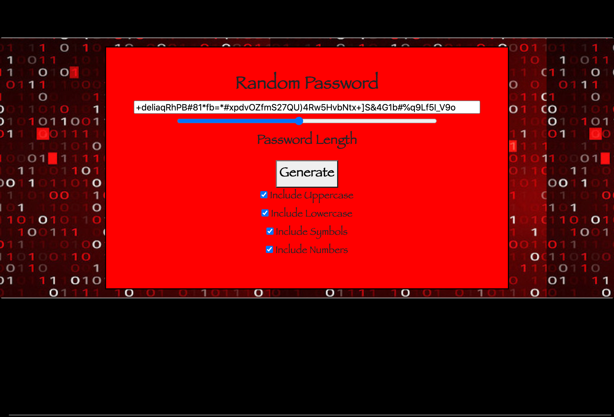

# Password-Gen

## Application Link

[Deployed Application](https://josephjlyons.github.io/Password-Gen/)

## Purpose

The purpose of this project was to created a random password generator that abides by certain criteria; when a certain character type (uppercase, lowercase, symbols, numbers) was selected or deselected the corresponding action would happen within the password. 

### Codes 
* HTML
* CSS
* BootStrap
* JavaScript

### How to Use 
Simply adjust the slide bar to select length of the password you desire from a min of 8 characters to a max of 128 characters. Password length slider can be adjusted by clicking and sliding with the mouse or can be selected with mouse and slide with the arrow left and arrow right keys. Slider moves or steps at a single increment at a time. Once you have selected a length click generate and your password will appear in the text box. If you would like a more defined password with only certain character types use a checkbox to select or deselect. Password will be generated in the text bar, once it is feel free to copy it and use it as your own password. 

### Mentions and Resources Used
The teacher and TA from the UNH Coding Bootcamp.
Many many online web services: Youtube, W3schools, MDN. 
A big shout out to my tutor as well Bobby Hoffman. 

### Contact 
* Email: josephjlyons90@gmail.com
* LinkedIn: www.linkedin.com/in/joseph-lyons-0a2630200/

# License 
Copyright (c) [2021] [Joseph Lyons]
Permission is hereby granted, free of charge, to any person obtaining a copy of this software and associated documentation files (the "Software"), to deal in the Software without restriction, including without limitation the rights to use, copy, modify, merge, publish, distribute, sublicense, and/or sell copies of the Software, and to permit persons to whom the Software is furnished to do so, subject to the following conditions:

The above copyright notice and this permission notice shall be included in all copies or substantial portions of the Software.

THE SOFTWARE IS PROVIDED "AS IS", WITHOUT WARRANTY OF ANY KIND, EXPRESS OR IMPLIED, INCLUDING BUT NOT LIMITED TO THE WARRANTIES OF MERCHANTABILITY, FITNESS FOR A PARTICULAR PURPOSE AND NONINFRINGEMENT. IN NO EVENT SHALL THE AUTHORS OR COPYRIGHT HOLDERS BE LIABLE FOR ANY CLAIM, DAMAGES OR OTHER LIABILITY, WHETHER IN AN ACTION OF CONTRACT, TORT OR OTHERWISE, ARISING FROM, OUT OF OR IN CONNECTION WITH THE SOFTWARE OR THE USE OR OTHER DEALINGS IN THE SOFTWARE.
